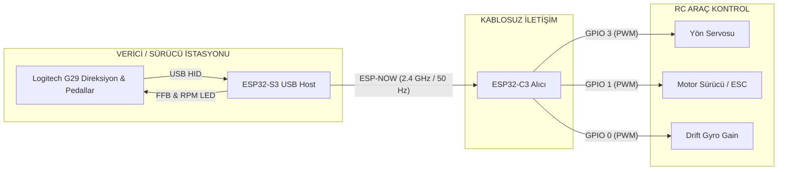

# 🏎️ Logitech G29 ESP-NOW RC Telemetry & Control System

[](https://platformio.org/)
[](https://www.espressif.com/)
[](https://www.espressif.com/)
[](https://www.espressif.com/en/solutions/low-power-solutions/esp-now)
[](https://www.logitechg.com/)

Bu proje; **Logitech G29** yarış direksiyonu ve pedal setini, harici bir bilgisayara ihtiyaç duymadan doğrudan **ESP32-S3 (USB Host)** üzerinden okuyup, ultra düşük gecikmeli **ESP-NOW** kablosuz protokolü ile RC araç üzerinde bulunan **ESP32-C3** alıcı ünitesine ileten gelişmiş bir uzaktan kontrol ve telemetri ekosistemidir.

Sistem; dinamik simüle edilmiş **Force Feedback (FFB)**, gaz pedalı ile senkronize **G29 Devir (RPM) LED'leri**, direksiyon üzerinden menülü **Dev Mode (EPA, Trim, Gyro, Eğri Ayarları)**, **5 farklı araç profili yönetimi**, **NVS kalıcılığı (Flash korumalı)** ve çift taraflı **Failsafe / Otomatik Yeniden Bağlanma** özellikleriyle donatılmıştır.

---

## 📌 İçindekiler
- [Sistem Mimarisi](#-sistem-mimarisi)
- [Öne Çıkan Özellikler](#-öne-çıkan-özellikler)
- [Direksiyon Tuş ve Kontrol Haritası](#-direksiyon-tuş-ve-kontrol-haritası)
- [Dev Mode (Direksiyon Üzeri Ayar Menüsü)](#-dev-mode-direksiyon-üzeri-ayar-menüsü)
- [Simüle Force Feedback (FFB) Fiziği](#-simüle-force-feedback-ffb-fiziği)
- [Donanım Bağlantıları ve Pin Şeması](#-donanım-bağlantıları-ve-pin-şeması)
- [Konfigürasyon Parametreleri](#-konfigürasyon-parametreleri)
- [Kurulum ve Yükleme (PlatformIO)](#-kurulum-ve-yükleme-platformio)

---

## 🏗️ Sistem Mimarisi



---

## ⚡ Öne Çıkan Özellikler

### 🎮 1. Yerel USB Host ve G29 Sürücüsü (ESP32-S3)
* **Otomatik PS3 Modu Uyandırma (Magic Packet):** G29 ilk bağlandığında PS3 modundan tam özellikli Native moda (`0xC24F`) otomatik geçirilir.
* **540° Direksiyon Açısı:** RC drift ve pist sürüşü için optimize edilmiş donanımsal 540 derece dönüş açısı.
* **Yüksek Hassasiyetli Ölü Bölge (Deadzone) Filtresi:** Direksiyon ve pedal potansiyometreleri için gürültü önleyici filtreleme.

### 🏎️ 2. Simüle Edilmiş Dinamik Force Feedback (FFB)
Araçta fiziksel sensör veya telemetri olmamasına rağmen sürücü girdileri analiz edilerek gerçek araç dinamikleri simüle edilir:
* **Park Hali Oturaklılığı:** Araç dururken lastiklerin asfalta sürtünmesi simüle edilir (`FFB_PARKED_FRICTION`), direksiyona hafif mekanik direnç verilir.
* **Sürüşte Yumuşama & Kaster Merkezleme:** Gaza dokunulduğu anda sürtünme sıfırlanır, hızlandıkça kaster açısı direksiyonu yumuşak ve zahmetsizce merkeze toplar.
* **Önden Kayma (Understeer) Hissi:** Yüksek hızda direksiyon aşırı kırıldığında ön lastik tutunma kaybı simüle edilerek merkezleme yay direnci %20 hafifletilir.
* **Canlı Aç/Kapa:** Sürüş esnasında **R3 tuşuna** basılarak veya `CONFIG.h` üzerinden simülasyon tek dokunuşla kapatılıp açılabilir.

### 🚦 3. Gaz Pedalı ile Senkronize RPM LED'leri
* Sürüş modunda G29 üzerindeki 5 kademeli devir LED'i gaz pedalının konumuna göre anlık senkronize çalışır:
  * `%0 – %10` : Sönük (Boşta / Rölanti)
  * `%10 – %30`: 1 Yeşil LED
  * `%30 – %50`: 2 Yeşil LED
  * `%50 – %70`: 2 Yeşil + 1 Sarı LED
  * `%70 – %90`: 2 Yeşil + 2 Sarı LED
  * `%90 – %96`: 5 LED Tamamı Sabit Açık
  * `%96 – %100`: **Shift Light / Kesici Flaş Efekti** (~80ms aralıklarla hızlı flaş)
* Akıllı önbellek mekanizması ile USB hattına gereksiz paket gönderilmez, 50 Hz sürüş paketlerinde sıfır gecikme sağlanır.

### 🚗 4. Çoklu Araç Yönetimi (5 Araç Desteği)
* S3 vericisi tek bir G29 ile **5 farklı RC aracı** yönetebilir.
* Direksiyon üzerinden tek hareketle araç değiştirilebilir.
* Her araç için EPA, Trim, Expo ve Gyro ayarları S3 ve C3 üzerindeki **NVS (Non-Volatile Storage)** bellekte bağımsız saklanır.

### 🛡️ 5. Çift Yönlü Güvenlik, Failsafe ve Auto-Reconnect
* **Sırasız Açılma Özgürlüğü:** Önce aracı, sonra direksiyonu açabilir; ya da tam tersini yapabilirsiniz.
* **Otomatik Yeniden Bağlanma:** Araçta pil değişimi yapıldığında veya sinyal koptuğunda S3 bunu ACK geri bildiriminden anında yakalar; araç açıldığı anda uyanma ve konfigürasyon paketlerini otomatik yeniden fırlatır.
* **Acil Durum Failsafe:** Direksiyon bağlantısı koptuğunda veya sinyal kesildiğinde araç gazı anında 1500 µs (Nötr / Stop) konumuna alır.
* **30 Saniye Hareketsizlik Uykusu:** Direksiyon ve pedallara 30 saniye dokunulmazsa motor akımları kesilir ve araç uyku moduna geçer.

---

## 🎮 Direksiyon Tuş ve Kontrol Haritası

### Normal Sürüş Modu (`STATE_SYS_ACTIVE`)
| Tuş / Eylem | İşlev | Bildirim / Geri Bildirim |
| :--- | :--- | :--- |
| **Direksiyon** | Ön tekerlek yön kontrolü (1000 - 2000 µs) | Simüle Kaster ve Merkezleme |
| **Gaz Pedalı** | İleri hız kontrolü (1500 - 2000 µs) | G29 RPM LED'leri Kademeli Yanar |
| **Fren Pedalı** | Fren ve Geri Vites (1500 - 1000 µs) | Ağırlık transferi direnci |
| **R3 Tuşu** | **FFB Simülasyonunu Canlı Aç / Kapat** | 2 Yeşil LED (Açık) / 1 Kırmızı LED (Kapalı) |
| **ENTER (Basılı Tut) + Dial Sağa / + / D-Pad Sağ** | **Sonraki Araca Geç (Araç 1 - 5)** | Geçilen aracın LED numarası yanar |
| **ENTER (Basılı Tut) + Dial Sola / - / D-Pad Sol** | **Önceki Araca Geç (Araç 1 - 5)** | Geçilen aracın LED numarası yanar |
| **PS Tuşu** *(veya SHARE + OPTIONS)* | **Dev Mode'a Giriş (1.5 sn basılı tut)** | 3 Kez Hızlı Flaş Animasyonu |

---

## 🛠️ Dev Mode (Direksiyon Üzeri Ayar Menüsü)

Direksiyon üzerinde **PS tuşuna 1.5 saniye basılı tutulduğunda** Dev Mode aktifleşir. Bu modda RC aracın tüm parametreleri bilgisayar veya tornavida olmadan direksiyon üzerinden ayarlanır:

### Menü Gezintisi
* **D-Pad YUKARI / AŞAĞI:** Menüler arasında geçiş yapar. Aktif menünün LED'i yanıp söner.
* **D-Pad SAĞ / SOL:** Menü içinde alt parametre seçer (Örn: Sol EPA / Sağ EPA).
* **Kırmızı Çark (Dial) veya +/- Tuşları:** Değeri artırır veya azaltır.
* **Kare (SQUARE) Tuşu:** Reverse (Ters Yön) ayarını tersine çevirir.
* **PS Tuşu (1.5 sn):** Dev Mode'dan çıkar, ayarları **NVS belleğe kaydeder** ve araca gönderir.

### Menü Listesi ve LED Gösterimleri

| Menü # | Gösterge LED'i | Parametre | Ayar Açıklaması |
| :---: | :---: | :--- | :--- |
| **1** | **Yeşil 1** | **Direksiyon EPA** | Direksiyon sol ve sağ maksimum dönüş limitleri (%30 - %120). Direksiyon sola çevrildiğinde sol, sağa çevrildiğinde sağ EPA ayarlanır. |
| **2** | **Yeşil 2** | **Direksiyon Expo / Eğri** | 0: Doğrusal (Linear), 1: Yumuşak Merkez Expo, 2: Agresif Drift Expo |
| **3** | **Sarı 1** | **Gaz & Fren EPA** | İleri maksimum gaz ve geri fren güç sınırları (%30 - %100). |
| **4** | **Sarı 2** | **Gaz Expo / Eğri** | 0: Doğrusal gaz tepkisi, 1: Yumuşak kalkış, 2: Agresif gaz |
| **5** | **Kırmızı** | **Direksiyon Sub-Trim** | Servo mekanik merkez kaçıklığını giderir. Merkezdeyken Sarı 1 LED'i yanar (-25 ile +25 derece). |
| **6** | **Yeşil 1 + Kırmızı** | **Gyro Gain (Kazanç)** | Drift jiroskopunun hassasiyetini ayarlar (%0 - %100, GPIO 0 PWM çıkışı). |
| **7** | **Orta 3 LED (Yeşil 2 + Sarı 1+2)** | **Araç Profili Seçimi** | Aktif aracı seçer (1 - 5 arası LED göstergeli). |

> 💾 **Flash Bellek Ömrü Koruması (Wear-Leveling):** Değerler değiştirilirken flash belleğe sürekli yazma yapılmaz. Ayarlar yalnızca Dev Mode'dan çıkıldığında ve değişiklik varsa tek seferde NVS'e yazılır.

---

## 🎛️ Simüle Force Feedback (FFB) Fiziği

Araç üzerinde fiziksel telemetri sensörü bulunmadığından, S3 içerisindeki fizik motoru girdileri aşağıdaki modele göre işler:

```
                  ┌───────────────┐
  Gaz Pedalı ───► │ Hız Entegrat. │ ──► Tahmini Hız (v_est)
  Fren Pedalı ──► │ ve Drag Modeli│
                  └───────┬───────┘
                          │
         ┌────────────────┴────────────────┐
         ▼                                 ▼
┌──────────────────┐             ┌──────────────────┐
│ Sürtünme Fiziği  │             │ Kaster & Merkez  │
│ - Park Hali: Ağır│             │ - Hızlandıkça    │
│ - Sürüş: Sıfır   │             │   kolay dönüş    │
│ - Fren: Yük trf. │             │ - Understeer gev.│
└────────┬─────────┘             └────────┬─────────┘
         │                                │
         └────────► [ G29 HID ] ◄─────────┘
```

### [CONFIG.h](file:///C:/Users/eraya/OneDrive/Desktop/Car_Project/Car_Project/ESP32_S3/lib/config/CONFIG.h) Parametreleri

```c
#define FFB_SIMULATION_ENABLED   1       // 1: Simüle FFB Açık, 0: Kapalı (Tamamen serbest direksiyon)
#define FFB_PARKED_FRICTION      0.28f   // Park halindeki hafif sertlik (0.0 - 1.0)
#define FFB_MIN_FRICTION         0.00f   // Sürüş halindeki sürtünme (0.00 = tüy gibi hafif, sıfır direnç)
#define FFB_MAX_FRICTION         0.25f   // Sert frende ulaşılabilecek maksimum sürtünme

#define FFB_PARKED_STRENGTH      0.08f   // Park halindeki merkezleme gücü (hafif)
#define FFB_MAX_STRENGTH         0.18f   // Sürüş halindeki merkezleme gücü (yumuşak ve tatlı dönüş)
#define FFB_PARKED_RATE          0.10f   // Park halindeki merkezleme eğimi
#define FFB_MAX_RATE             0.25f   // Sürüş halindeki merkezleme eğimi (yumuşak yay)
```

---

## 🔌 Donanım Bağlantıları ve Pin Şeması

### 1. ESP32-S3 Verici Ünitesi (Direksiyon Tarafı)
| ESP32-S3 Pini | Bağlantı | Açıklama |
| :--- | :--- | :--- |
| **GPIO 19** | USB D- | Logitech G29 USB Beyaz Kablo |
| **GPIO 20** | USB D+ | Logitech G29 USB Yeşil Kablo |
| **5V (VBUS)** | USB 5V | Logitech G29 Kırmızı Kablo (Harici 5V önerilir) |
| **GND** | USB GND | Logitech G29 Siyah Kablo |
| **GPIO 48** | Dahili RGB LED | Sistem durumu (Mavi: Bekliyor, Yeşil: Aktif, Kırmızı: Hata) |

### 2. ESP32-C3 Alıcı Ünitesi (Araç Tarafı)
| ESP32-C3 Pini | Donanım | Açıklama |
| :--- | :--- | :--- |
| **GPIO 3** | Yön Servosu Sinyali | Standart 50 Hz PWM (1000 - 2000 µs) |
| **GPIO 1** | ESC / Motor Sürücü Sinyali | Standart 50 Hz PWM (1000 - 2000 µs) |
| **GPIO 0** | Drift Gyro Gain Sinyali | Hassasiyet kontrolü (1000 - 2000 µs) |
| **GPIO 8** | Dahili Durum LED'i | Bağlantı durumu göstergesi |
| **5V / VIN** | BEC (ESC 5V Çıkışı) | Alıcı beslemesi |
| **GND** | Ortak GND | Araç şasesi / pil eksi ucu |

---

## ⚙️ Konfigürasyon Parametreleri

### Araç MAC Adres Tablosu ([CONFIG.h](file:///C:/Users/eraya/OneDrive/Desktop/Car_Project/Car_Project/ESP32_S3/lib/config/CONFIG.h))
Çoklu araç kullanmak için S3 içerisindeki MAC tablosuna araçlarınızın ESP32-C3 MAC adreslerini ekleyin:

```c
static const uint8_t CAR_MAC_TABLE[CAR_MAX_COUNT][6] = {
    {0x90, 0x64, 0x9B, 0x08, 0x0E, 0x6C}, // Araç 1 (ID 0)
    {0x00, 0x00, 0x00, 0x00, 0x00, 0x00}, // Araç 2 (ID 1)
    {0x00, 0x00, 0x00, 0x00, 0x00, 0x00}, // Araç 3 (ID 2)
    {0x00, 0x00, 0x00, 0x00, 0x00, 0x00}, // Araç 4 (ID 3)
    {0x00, 0x00, 0x00, 0x00, 0x00, 0x00}, // Araç 5 (ID 4)
};
```

---

## 🚀 Kurulum ve Yükleme (PlatformIO)

Her iki proje de **ESP-IDF v6.0.1** tabanlı olup **PlatformIO** ile derlenmeye hazırdır.

### 1. ESP32-S3 (Verici) Derleme ve Yükleme
```bash
cd ESP32_S3
pio run -e esp32-s3-devkitc-1 --target upload
```

### 2. ESP32-C3 (Alıcı) Derleme ve Yükleme
```bash
cd ESP32_C3
pio run -e esp32-c3-devkitm-1 --target upload
```

### 3. İlk Çalıştırma
1. Logitech G29 setini 24V harici adaptörüne takın.
2. Direksiyonun üzerindeki mod anahtarının **PS3** konumunda olduğundan emin olun.
3. G29 USB kablosunu ESP32-S3'ün USB Host pinlerine bağlayın.
4. ESP32-S3 direksiyonu otomatik algılayacak, kalibrasyonunu tamamlayacak ve hazır hale getirecektir.
5. RC aracınıza güç verin; sistem anında eşleşecek ve sürüşe hazır olacaktır!

