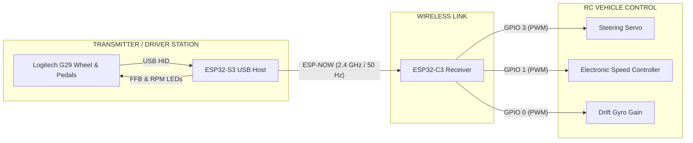

# 🏎️ Logitech G29 ESP-NOW RC Telemetry & Control System

[](https://platformio.org/)
[](https://www.espressif.com/)
[](https://www.espressif.com/)
[](https://www.espressif.com/en/solutions/low-power-solutions/esp-now)
[](https://www.logitechg.com/)

This project is an advanced, standalone remote control and telemetry ecosystem that interfaces a **Logitech G29** racing wheel and pedal set directly via an **ESP32-S3 (USB Host)**—without requiring a PC—and transmits low-latency control packets to an **ESP32-C3** receiver installed on an RC vehicle via **ESP-NOW** at 50 Hz.

The system features dynamic simulated **Force Feedback (FFB)**, throttle-synchronized **RPM LEDs**, an interactive on-wheel **Dev Mode (EPA, Trim, Gyro, and Curve tuning)**, support for **5 distinct vehicle profiles**, flash wear-protected **NVS persistence**, and bidirectional **Failsafe / Auto-Reconnection**.

---

## 📌 Table of Contents
- [System Architecture](#-system-architecture)
- [Key Features](#-key-features)
- [Wheel Controls & Button Mapping](#-wheel-controls--button-mapping)
- [Dev Mode (On-Wheel Configuration GUI)](#-dev-mode-on-wheel-configuration-gui)
- [Simulated Force Feedback (FFB) Physics](#-simulated-force-feedback-ffb-physics)
- [Hardware Wiring & Pinout](#-hardware-wiring--pinout)
- [Configuration Reference](#-configuration-reference)
- [Setup & Flashing (PlatformIO)](#-setup--flashing-platformio)

---

## 🏗️ System Architecture



---

## ⚡ Key Features

### 🎮 1. Native USB Host & G29 Driver (ESP32-S3)
* **Automatic PS3 Mode Wake-Up (Magic Packet):** Automatically transitions the G29 from PS3 compatibility mode to native high-precision mode (`PID: 0xC24F`).
* **Hardware 540° Steering Range:** Calibrated for RC drifting and circuit driving.
* **Deadband & Precision Mapping:** Eliminates analog potentiometer noise around steering center and pedal resting positions.

### 🏎️ 2. Dynamic Simulated Force Feedback (FFB)
Because RC models lack onboard telemetry sensors, the S3 runs a lightweight vehicle dynamics physics model:
* **Parked Resistance (Tire Scrub):** At zero speed, simulates tire contact scrub resistance against pavement (`FFB_PARKED_FRICTION`), giving a grounded, realistic wheel weight.
* **Instant Throttle Softening:** The instant throttle is applied, friction drops immediately to `0.00`, allowing the wheel to turn effortlessly and smoothly.
* **Caster Centering (Self-Aligning Torque):** As vehicle speed builds, caster geometry naturally guides the wheel back to center.
* **Understeer Simulation:** At high speeds with extreme steering angle, front tire grip loss is simulated by softening centering torque by 20%.
* **Live Toggle:** Toggle FFB on or off in real time by pressing **R3** or setting `#define FFB_SIMULATION_ENABLED` in `CONFIG.h`.

### 🚦 3. Throttle-Synchronized RPM Shift LEDs
* In driving mode, the G29's 5 shift LEDs synchronize with throttle pedal position:
  * `0% – 10%`: All LEDs Off (Idle / Deadband)
  * `10% – 30%`: 1 Green LED
  * `30% – 50%`: 2 Green LEDs
  * `50% – 70%`: 2 Green + 1 Yellow LED
  * `70% – 90%`: 2 Green + 2 Yellow LEDs
  * `90% – 96%`: All 5 LEDs Solid On (Green + Yellow + Red)
  * `96% – 100%`: **Rev Limiter / Shift Light Flash** (~80 ms rapid blink)
* Smart cache filtering ensures USB OUT packets are only dispatched when the LED mask changes, avoiding USB bus saturation.

### 🚗 4. Multi-Vehicle Management (5 Cars Supported)
* Manage up to **5 different RC vehicles** from a single G29 steering wheel.
* Switch active cars on the fly using **ENTER + Rotary Dial**.
* Independent EPA, Trim, Expo curves, and Gyro Gain profiles are stored in **NVS (Non-Volatile Storage)** on both S3 and C3.

### 🛡️ 5. Bidirectional Safety, Failsafe & Auto-Reconnection
* **Power-On Order Independence:** Turn on the wheel or the car in any order; the connection establishes seamlessly.
* **Auto-Reconnect with ACK Tracking:** If the vehicle battery is swapped or power drops, the S3 detects packet acknowledgments and automatically sends wake-up and config packets upon reconnection.
* **Hardware Failsafe:** Shuts off throttle (neutral 1500 µs) immediately if the USB cable disconnects or RF packets drop.
* **Inactivity Sleep:** Enters power-saving sleep after 30 seconds of inactivity.

---

## 🎮 Wheel Controls & Button Mapping

### Normal Driving Mode (`STATE_SYS_ACTIVE`)
| Control / Action | Function | Feedback / Status |
| :--- | :--- | :--- |
| **Steering Wheel** | Front steering control (1000 – 2000 µs) | Simulated caster return |
| **Throttle Pedal** | Forward speed control (1500 – 2000 µs) | RPM shift LEDs illuminate |
| **Brake Pedal** | Brake & Reverse (1500 – 1000 µs) | Weight transfer resistance |
| **R3 Button** | **Toggle Simulated FFB On / Off** | 2 Green LEDs (On) / 1 Red LED (Off) |
| **ENTER (Hold) + Dial Right / + / D-Pad Right** | **Switch to Next Car (Cars 1 – 5)** | Active car ID LED blinks |
| **ENTER (Hold) + Dial Left / - / D-Pad Left** | **Switch to Previous Car (Cars 1 – 5)** | Active car ID LED blinks |
| **PS Button** *(or SHARE + OPTIONS)* | **Enter Dev Mode (Hold for 1.5s)** | 3 Fast LED Flash Intro Animation |

---

## 🛠️ Dev Mode (On-Wheel Configuration GUI)

Holding the **PS button for 1.5 seconds** activates Dev Mode, allowing real-time calibration of the vehicle without a computer or screwdriver:

### Menu Navigation
* **D-Pad UP / DOWN:** Cycle through menus. The LED of the active menu blinks.
* **D-Pad RIGHT / LEFT:** Select sub-parameters (e.g. Left EPA vs. Right EPA).
* **Rotary Dial or +/- Buttons:** Increment or decrement parameter values.
* **SQUARE Button:** Toggle channel reverse (Invert direction).
* **PS Button (1.5s):** Exit Dev Mode, commit changes to **NVS flash**, and send updated config to the vehicle.

### Menu List & LED Indicators

| Menu # | LED Indicator | Parameter | Description |
| :---: | :---: | :--- | :--- |
| **1** | **Green 1** | **Steering EPA** | Independent Left / Right end-point adjustment (30% – 120%). Turn the wheel left to adjust Left EPA, turn right to adjust Right EPA. |
| **2** | **Green 2** | **Steering Curve / Expo** | 0: Linear, 1: Mild Center Expo, 2: Aggressive Drift Expo |
| **3** | **Yellow 1** | **Throttle & Brake EPA** | Forward maximum throttle and reverse/brake maximum power (30% – 100%). |
| **4** | **Yellow 2** | **Throttle Curve / Expo** | 0: Linear, 1: Soft Launch Expo, 2: Aggressive Throttle |
| **5** | **Red** | **Steering Sub-Trim** | Mechanical servo center calibration. Center position indicated by Yellow 1 LED (-25 to +25 degrees). |
| **6** | **Green 1 + Red** | **Gyro Gain** | Drift gyro sensitivity (0% – 100%, output on GPIO 0 PWM). |
| **7** | **Middle 3 LEDs (Green 2 + Yellow 1+2)** | **Car Profile Select** | Selects active car profile (1 – 5 with LED indicator). |

> 💾 **Flash Wear-Leveling Protection:** Values adjusted during Dev Mode are kept in RAM until exiting Dev Mode (or after 5 seconds of inactivity), preventing unnecessary write cycles to flash memory.

---

## 🎛️ Simulated Force Feedback (FFB) Physics

Because RC models do not carry sensors, the S3 simulates vehicle dynamics directly from driver inputs:

```
                  ┌────────────────┐
  Throttle Pedal ─►│ Speed Integr.  │ ──► Estimated Speed (v_est)
  Brake Pedal ────►│  & Drag Model  │
                  └───────┬────────┘
                          │
         ┌────────────────┴────────────────┐
         ▼                                 ▼
┌──────────────────┐             ┌──────────────────┐
│  Friction Model  │             │ Caster & Return  │
│ - Parked: Weight │             │ - Speed-based    │
│ - Throttle: Zero │             │   caster pull    │
│ - Brake: Weight  │             │ - Understeer slip│
└────────┬─────────┘             └────────┬─────────┘
         │                                │
         └────────► [ G29 HID ] ◄─────────┘
```

### [CONFIG.h](file:///C:/Users/eraya/OneDrive/Desktop/Car_Project/Car_Project/ESP32_S3/lib/config/CONFIG.h) Parameters

```c
#define FFB_SIMULATION_ENABLED   1       // 1: Enabled, 0: Disabled (Wheel runs completely free)
#define FFB_PARKED_FRICTION      0.28f   // Parked mechanical friction (0.0 - 1.0)
#define FFB_MIN_FRICTION         0.00f   // Driving friction (0.00 = feather-light, zero resistance)
#define FFB_MAX_FRICTION         0.25f   // Maximum friction under heavy braking

#define FFB_PARKED_STRENGTH      0.08f   // Parked centering spring strength
#define FFB_MAX_STRENGTH         0.18f   // Driving centering spring strength (smooth return)
#define FFB_PARKED_RATE          0.10f   // Parked centering ramp slope
#define FFB_MAX_RATE             0.25f   // Driving centering ramp slope
```

---

## 🔌 Hardware Wiring & Pinout

### 1. ESP32-S3 Transmitter (Steering Wheel Side)
| ESP32-S3 Pin | Connection | Description |
| :--- | :--- | :--- |
| **GPIO 19** | USB D- | Logitech G29 USB White Wire |
| **GPIO 20** | USB D+ | Logitech G29 USB Green Wire |
| **5V (VBUS)** | USB 5V | Logitech G29 USB Red Wire (External 5V supply recommended) |
| **GND** | USB GND | Logitech G29 USB Black Wire |
| **GPIO 48** | Onboard RGB LED | System status (Blue: Waiting, Green: Active, Red: Error) |

### 2. ESP32-C3 Receiver (Vehicle Side)
| ESP32-C3 Pin | Target Hardware | Description |
| :--- | :--- | :--- |
| **GPIO 3** | Steering Servo Signal | Standard 50 Hz PWM (1000 – 2000 µs) |
| **GPIO 1** | ESC / Throttle Signal | Standard 50 Hz PWM (1000 – 2000 µs) |
| **GPIO 0** | Drift Gyro Gain Signal | Sensitivity PWM (1000 – 2000 µs) |
| **GPIO 8** | Onboard Status LED | Connection state indicator |
| **5V / VIN** | BEC (ESC 5V Output) | Receiver power supply |
| **GND** | Common GND | System ground / battery negative |

---

## ⚙️ Configuration Reference

### Vehicle MAC Address Table ([CONFIG.h](file:///C:/Users/eraya/OneDrive/Desktop/Car_Project/Car_Project/ESP32_S3/lib/config/CONFIG.h))
Add your ESP32-C3 MAC addresses to the table on the S3:

```c
static const uint8_t CAR_MAC_TABLE[CAR_MAX_COUNT][6] = {
    {0x90, 0x64, 0x9B, 0x08, 0x0E, 0x6C}, // Car 1 (ID 0)
    {0x00, 0x00, 0x00, 0x00, 0x00, 0x00}, // Car 2 (ID 1)
    {0x00, 0x00, 0x00, 0x00, 0x00, 0x00}, // Car 3 (ID 2)
    {0x00, 0x00, 0x00, 0x00, 0x00, 0x00}, // Car 4 (ID 3)
    {0x00, 0x00, 0x00, 0x00, 0x00, 0x00}, // Car 5 (ID 4)
};
```

---

## 🚀 Setup & Flashing (PlatformIO)

Both projects are built on **ESP-IDF v6.0.1** and managed via **PlatformIO**.

### 1. Build and Flash ESP32-S3 (Transmitter)
```bash
cd ESP32_S3
pio run -e esp32-s3-devkitc-1 --target upload
```

### 2. Build and Flash ESP32-C3 (Receiver)
```bash
cd ESP32_C3
pio run -e esp32-c3-devkitm-1 --target upload
```

### 3. First Power-On
1. Connect the Logitech G29 wheel to its 24V power supply.
2. Ensure the top mode switch is set to **PS3**.
3. Plug the G29 USB cable into the ESP32-S3 USB Host port.
4. The ESP32-S3 automatically wakes the wheel, completes calibration, and enters ready state.
5. Power up the RC car; pairing is instantaneous and ready to drive!
